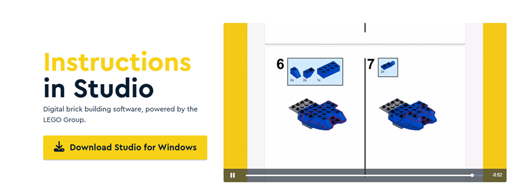
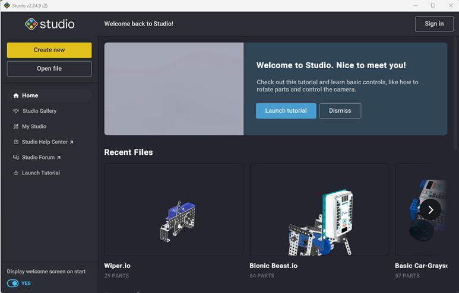
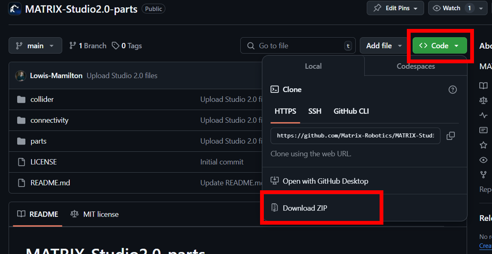
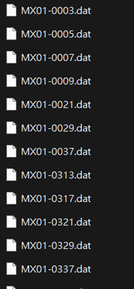
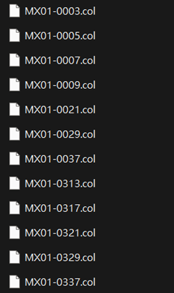
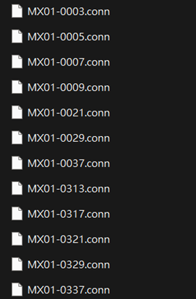
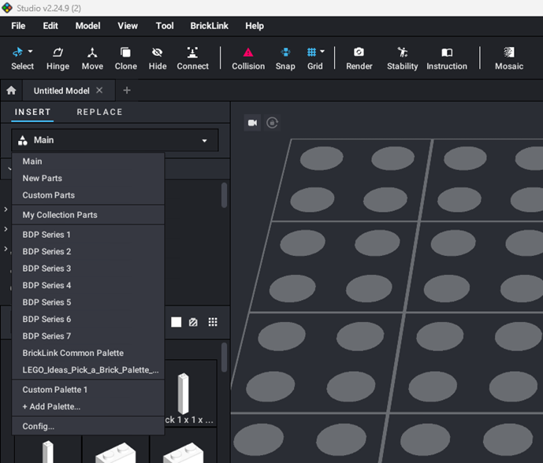
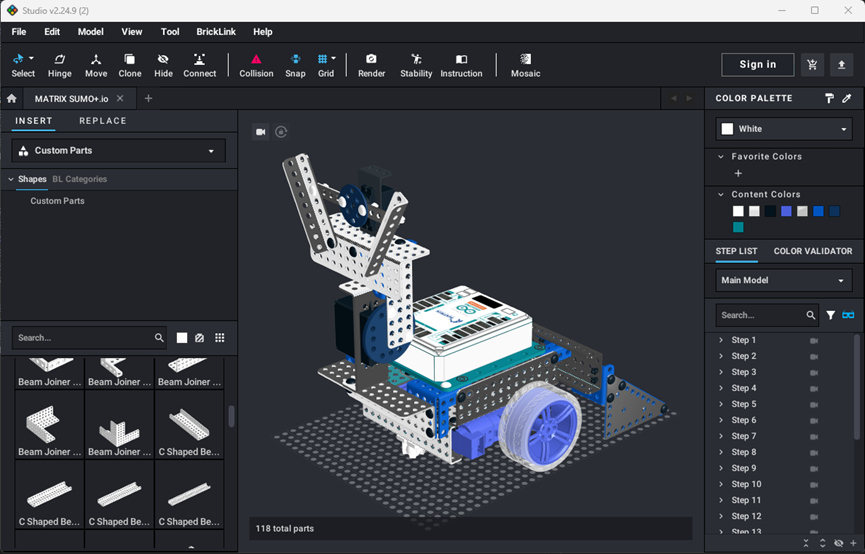

# MATRIX Building System Studio 2.0 User Manual

### Step1: Download Studio 2.0

1.	Visit the BrickLink website. 
Link: https://www.bricklink.com/v3/studio/download.page
2.	Choose Your Version and download the Installer.

### Step2: Install Studio 2.0

1.	Run the Installer. Locate the downloaded installer file and double-click to launch it.
2.	Complete Installation. Once the installation is finished, click Finish to close the setup wizard.

### Step3: Open Studio 2.0

1.	Launch Studio 2.0 by double-clicking the desktop shortcut or accessing it from your application menu.

Successful installation opening screen:

### Step4: Import MATRIX Parts Files

1.	Visit the Matrix Studio 2.0 Parts official GitHub repository
Link: https://github.com/Matrix-Robotics/MATRIX-Studio2.0-parts
2.	Download .ZIP file. (Code / Download ZIP)

3.	Unzip the Folder
4.	find the Stud.io directory on your machine. 

* `Windows:`
C:\Users\[user name]\AppData\Local\Stud.io
* `macOS:`
    * If you installed Stud.io globally, it should be:  
    [user name]/Applications/Studio 2.0/Stud.io
    * If you just installed it in your user account, it'll presumably be:  
    [user name]/Users/[account name]/Applications/Studio 2.0/Stud.io
5.	Copy files in the specified folder to the specified folder location.
* parts(.dat) ---> Stud.io/CustomParts/parts
* collider(.col) ---> Stud.io/CustomParts/collider
* connectivity(.conn) ---> Stud.io/CustomParts/connectivity

| parts |collider | connectivity |
| --- | --- | --- |
| |||

### Step5: Restart the Studio 2.0

1.	After you restart the Studio 2.0, you can find the MATRIX parts in the Custom Parts.

### Step6: Start to build your own MATRIX Robot!!	

## Support

For additional help, visit the official [MATRIX Robotics website](https://www.matrixrobotics.com) or reach out to our [support team](mailto:sales@kkitc.net).

---

Thank you for choosing MATRIX Robotics. We’re excited to see what you build!